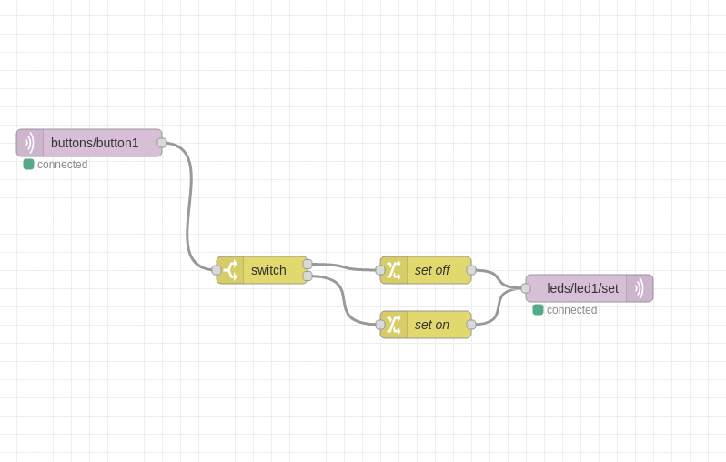
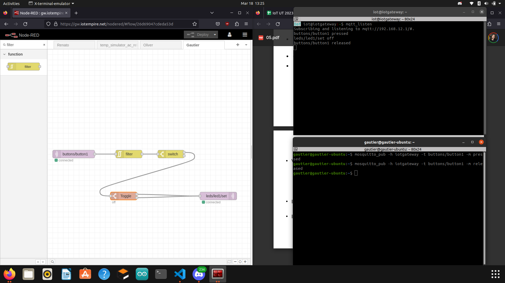

### IoT Frameworks 1

How can we develop and manage software faster for IoT?

*Key Challenges*

* 300+ IoT platforms to make work together.
* Half the cost is for integration.
* Significant latency in connectivity
* Cost-effective connectivity
* Devices have a low bandwith to connect
* ...

*Generic solution(s)*

* MQTT, CoaP...
* Creation of many standards
* Hybrid Integration Platforms : the "new default".

*Two examples used for **patterns***

* Publish/Subscribe
* Enterprise integration

### IoT Frameworks 2

*Different categories*

* Dataflow Pipelines (DP)
* Stream Processing (SP)
* Process Engine (PE)

*Main features*

* DP --> Take data from A to B applying some transformation to it in between.
* SP --> Correlating and aggregating data while it's in motion.
* PE --> Integrate and wire together sensor and devices. Handle error, re-tryn re-routen wait. Doing logic at the edge, in real-time.

*Applications*

* DP --> 
* SP --> Machine Learning, real-time IoT scenarios, streaming services (Amazon, Netflix...).
* PE --> Consumer IoT (device diagnostic, registration...)/ Industrial IoT (performance diagnostic, lifecycle assessment...).

*Tools*

* DP -->
* SP --> 
* PE --> Node-RED, Eclipse, Flogo..

### Node-RED intro

*Flow 1* 

*Flow 2*

*The flows ad JSON*

[Flow 1](../../Additional_things/Node-RED_flows/Node-RED_Intro/flow1.json)

[Flow 2](../../Additional_things/Node-RED_flows/Node-RED_Intro/flow2.json)

### Node-RED dashboard
*(Late update)*
None of the flows here contain UI elements, therefore the dashboard is a blank page. But as shown in the [lab of Week 7](/Pair_Folder/Labs/Week_7/Readme.md) report we have a button for the access control project which displays whether if the access is granted or not.