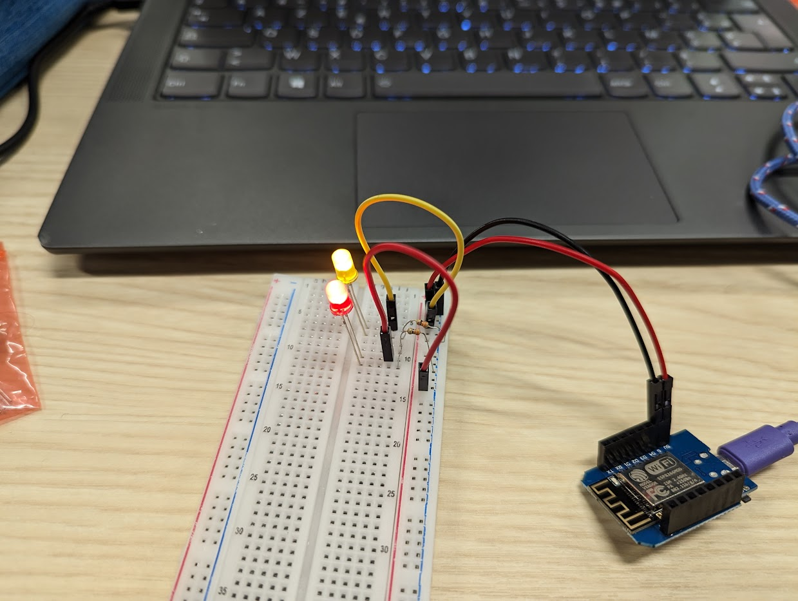
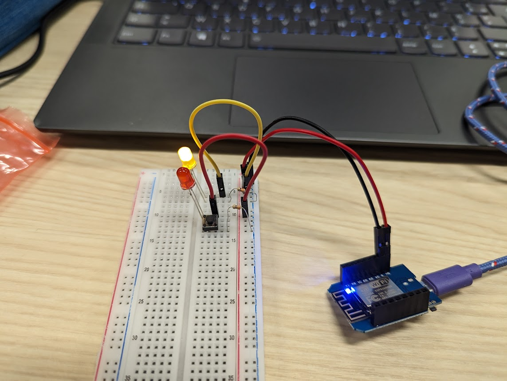
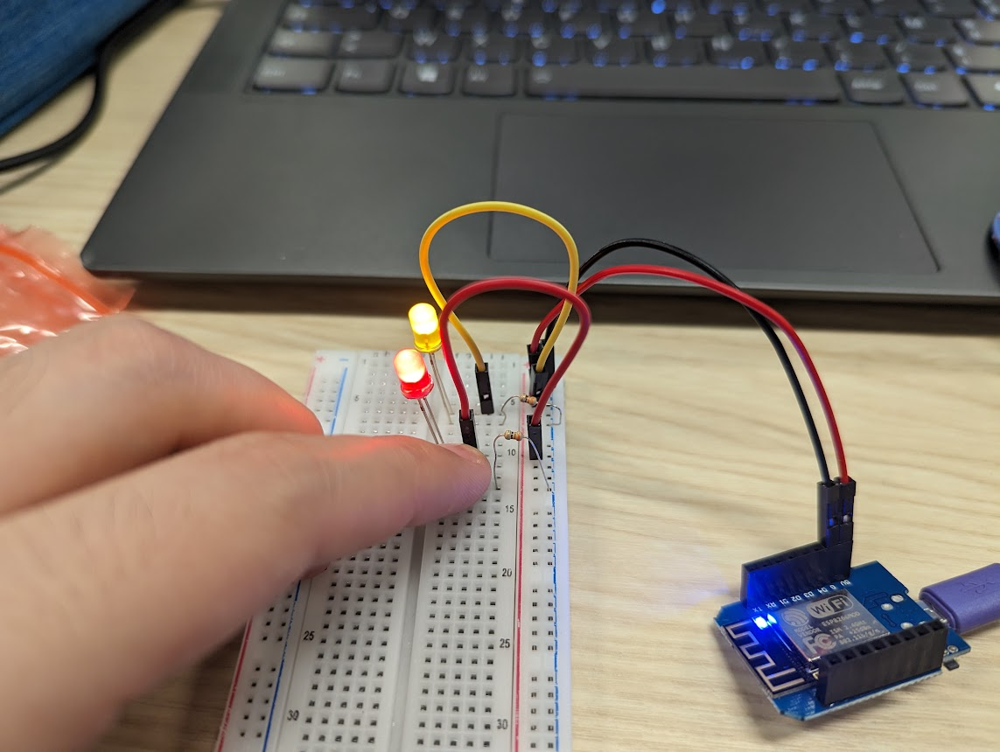

### Breadboard and Electronic Prototyping

For this step nothing to tricky, with the video and previous experience we easily had the circuit mounted on the breadboard as shown on the picture below:

Then we added a button to control the red LED. As shown by the two pictures below, the LED is lit only when the button is pressed.

### Reflection (Second lab)