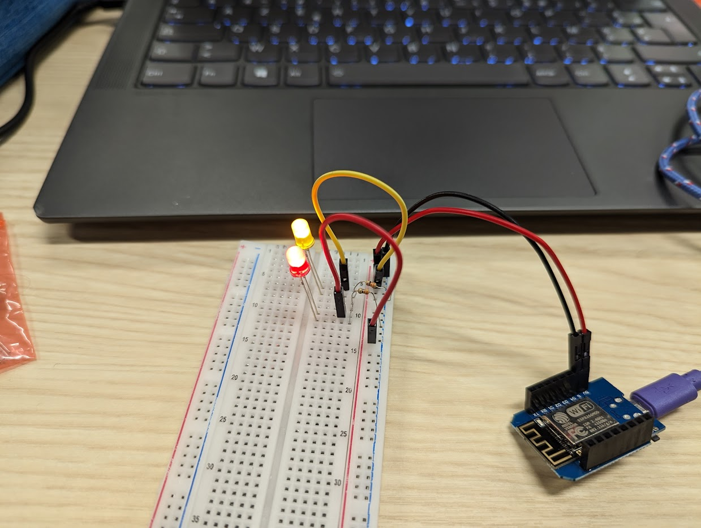
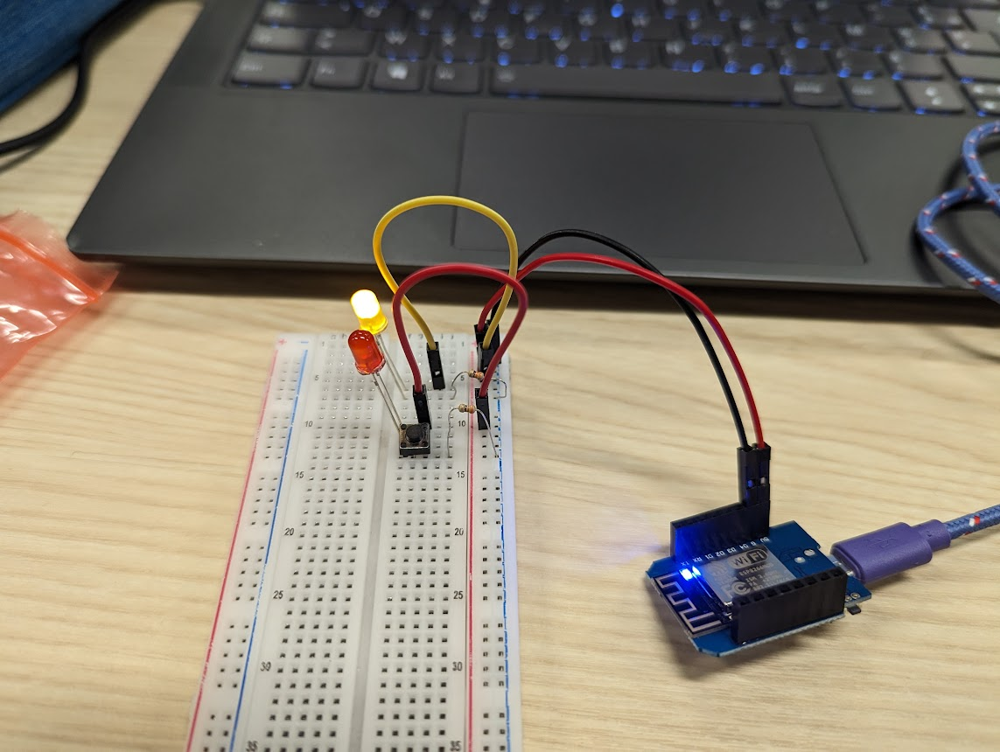
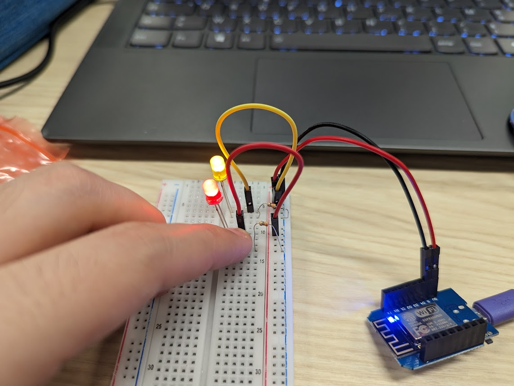

### Breadboard and Electronic Prototyping

For this step nothing to tricky, with the video and previous experience we easily had the circuit mounted on the breadboard as shown on the picture below:

Then we added a button to control the red LED. As shown by the two pictures below, the LED is lit only when the button is pressed.

### Blink on the Wemos D1 Mini

As shown in the GIF below, we got the Blink sketch working on the D1 Mini, and we also added some extra LEDs. To make sure they blink in sync we altered the example sketch by reversing the order of High and Low states on the built-in LED, since we know it's reversed.

### Toggle Led With Button

Combining the wiring of the two previous steps, we managed to get the LED to be lit by button presses, relying on digitalRead() and digitalWrite() functions. A key element here is the pull down resistor between the button's output and the ground. Without this resistor the MCU registers a High state on the pin and the LED lights up although the button is technically not pressed. 

