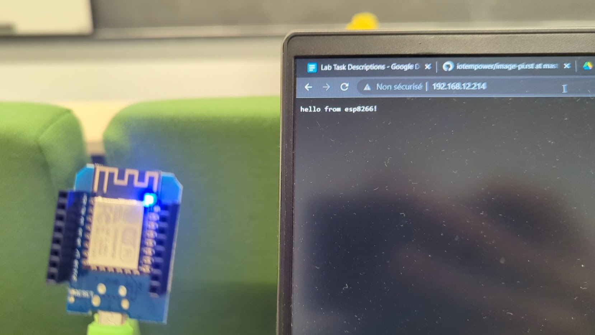
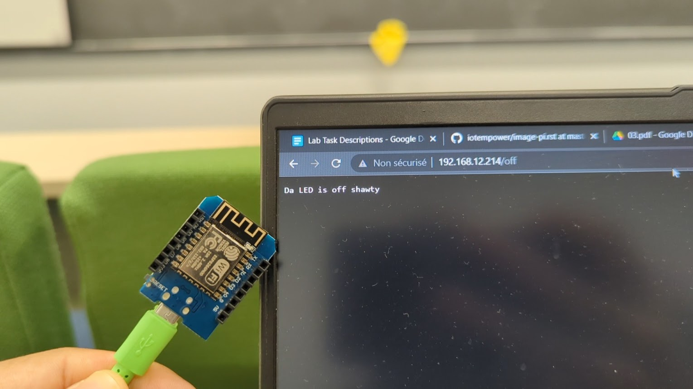
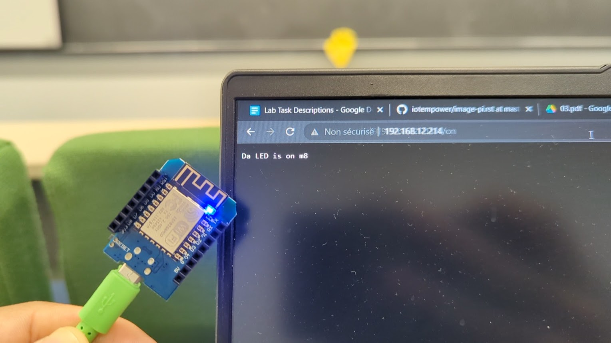
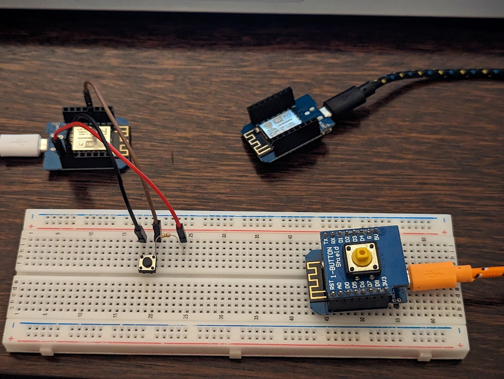

## IoTempower Gateway

Useful LINK:
Flashing - https://github.com/iotempire/iotempower/blob/master/doc/image-pi.rst
Setting up WIFI - https://github.com/iotempire/iotempower/blob/master/doc/quickstart-pi.rst

### Flashing SD and setting up the ACCESS point

Tasks

Setup IoTempower gateway, make sure wifi and internet work (follow video and manuals below)
Download, verify, flash pi-image (with balena etcher)
Check some services offered
Log the process into pair portfolio

**ISSUES:**
We didn't comment out the WIFI SSD first so not WIFI yet.

We did not want to use our EDUROAM password so we took the Tethering route.

Forwarding the internet to the personal computer was not routing form the PI. We tried to reboot it, but no problem.

We should not have any WIFI-IN configured when using tethering

Tethering is the easiest way to get internet.

## Actors and Sensors with Web Requests

### Control Led with Web Request

For this task, we simply used the Arduino Example sketch "HelloServer" and added endpoints for the **on** and **off** states of the LED. Once the µ-controller is connected to the internet, we simply copy the IP that's prompted in the Serial Monitor and paste it to a browser. Adding "/on" or "/off" to the IP triggers the associated HTTP request that controls the LED.

Here is a demo:

Webserver home page

LED OFF

LED ON

### Using a button to create a web request

Here, we experimented with two approaches: 

1. We mounted the button shield on a second µ-controller, which hosts an altered version of the example "BasicHttpClient". The idea is to trigger HTTP requests for the **/on** and **/off** endpoints sequentially, with some delay, to blink the built-in LED of the first µ-controller.

The button logic is fairly easy, we just monitor a change of state on the GPIO pin to which the button is connected, and trigger/ initiate the loop of requests accordingly. The LED should blink 4 times and stop until the button is pressed again.

2. The second approach is to create a new endpoint on the server side, which makes the LED blink when triggered. On the client side there's no more need for a loop with delays, just a single HTTP request is necessary on the **/blink** endpoint.

The outcome is the same, and the LED blinks as shown by the animated images below. The only difference is that on one hand we store all the blinking logic on the server side, and the button logic on the client's, and the other we kind of mix the two.

As an extra step we added a third µ-controller with a regular button mounted on a breadboard. It hosts the same client code as the shielded D1 mini, but we just changed the GPIO pin to which the button is connected. Below are pictures of the contraption and an example of blinking LEDs.

**The Arduino sketches of this lab:**

[Server](../../Arduino_sketches/ESP_Webserver_Lab3/ESP_Webserver_Lab3.ino)

[Client](../../Arduino_sketches/ESP_Blink_button_Lab3/ESP_Blink_button_Lab3.ino)

## Stories/Scenarios

Find a way to grown micro-greens indoors in our homes. 

Olinato Reyvai loves to eat fresh salad, but he just moved to Tartu, Estonia in the winter and is having vitamin withdrawals. He needs to eat more fresh greens and he found that the salads that can be bought at supermarkets come from foreign countries and are not fresh enough.

He is newbie gardener, but he is willing to try out some ideas he found on the internet. 
He started brainstorming some ideas. He lives on the sixth floor and facing the sun rise. He thinks he can grow some micro-green with the sunlight from his window. 
He is not sure, he might need complement the light with an LED grown lights. 
He wants to grown enough salad for himself eventually just on the balcony of his window with window planter box.

List of IoT:

- He wants to measure the amount light that comes in the window;
- Maybe control an LED light;
- Measure the hight of the plants from the light;
- Measure PH from water;
- He needs to control a water pump for auto watering;
- Measure Ar humidity;
- Monitoring data daily (graph the data);
- CO2 sensor;
- Timelapse the growth of plants (Instagram);