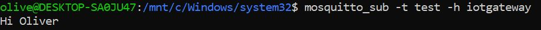
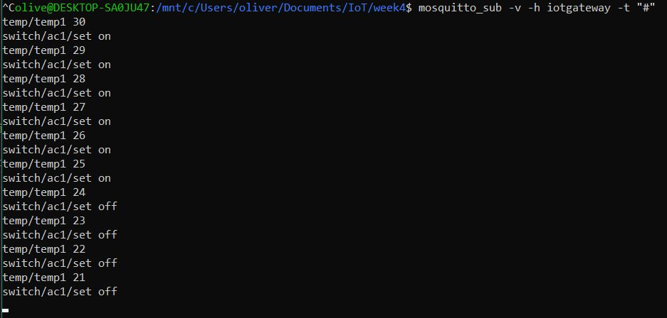

## Stories/Scenarios

Find a way to grown micro-greens indoors in our homes. 

Olinato Reyvai loves to eat fresh salad, but he just moved to Tartu, Estonia in the winter and is having vitamin withdrawals. He needs to eat more fresh greens and he found that the salads that can be bought at supermarkets come from foreign countries and are not fresh enough.

He is newbie gardener, but he is willing to try out some ideas he found on the internet. 
He started brainstorming some ideas. He lives on the sixth floor and facing the sun rise. He thinks he can grow some micro-green with the sunlight from his window. 
He is not sure, he might need complement the light with an LED grown lights. 
He wants to grown enough salad for himself eventually just on the balcony of his window with window planter box.

**Story**

Olinato wakes up one day and realizes that the amount of light entering his window was quite bright. He decides to put a LDR sensor to collect some data on how much light is hitting his window on a sunny day at that time of the year. He writes a Python script to save the data on to a excel table. LDR gives a resistance reading on the analog port. He uses a LUT table to translate those values into LUX. After a week he realizes that the values change quite dramatically depending on the weather. The learning curve is long term to understand how much light the plants will need and if we can get them from the window or complement it with some growing LEDs. 

He decides to get a planter box some soil and micro-greens seeds to start planting right a way. He buys the self-watering planter box which has a container for the water underneath that can last many days. Olinato decides to install a water sensor to measure the amount of water in the tank. This reading only needs to be done twice a day so the node can stay in sleep mode most of the time. Whenever the water is low or dry, a message must be sent to Olinato so that he can refill the water in the tank. A log is kept of how many times the water was replaced so he can know how much water is being used. This data can also help him understand how many water cycles the pants go through before it is time to fertilize again. In the same tank, he decides to install a pH sensor to measure the water's pH level as he suspect that the tap water in Tartu is Alkaline. If so, action should be taken to bring the water's pH level to between 6 and 7 level.  

At first, he does not want to automate the watering system because he does not have access to the a faucet nearby. This watering time, when done by hand is also a good time for him to do a visual check on the plants to see if they are doing well. Olinato intends to implement the automatic water system if he has to leave on a vacation trip. For the automation he will some kind of a water pump.

He also thinks wants to collect data from the soil humidity and also air humidity to further analyses the relationship between these and how fast the tank water must be refilled.

After the plants start to grow a little it is time to understand how well they are growing. Of course this can be done visually but we can also measure some data like:
- How tall the plants are growing with distance sensor;
- How green are the plants using a color frequency sensor;
Both of these measurements can be done once a day only as these changes happens slowly over time.

After the first prototype is running, Olinato decides to implement some kind of dashboard and simple data base where he can visualize the data collected to help him take more conscious decisions. Some graph plotting will also help him visualize the data. 

He realizes that in the darkest months of the Estonian winter, the window light is not sufficient for the growth of the micro-greens. Olinato decides to than install the LED growing lights to compliment the amount of light needed for the plants to be healthy. He install a relay to turn the lights on/off if the amount of light drops bellow threshold to early in the day. He needs a some kind of computation that will calculate the amount of light and time period that that plants received of sun light that day and activate the complementary LEDs accordantly. This will be specially tricky as different plants have different needs in different stages of their lives even though micro-greens should be fairly simple in their needs. IoT communication between the Light measuring Node and the LED node is needed. Perhaps the the computation can be done in the gateway itself.   

After the first prototype has been refined, he decides to also hack a CO2 sensor to see if he can collect soil CO2 information. This is a challenge as these sensors are not made to be inside the earth. He also would like to install a camera to take timelapse video of the growing plants. 

List of IoT:

- He wants to measure the amount light that comes in the window;
- Maybe control an LED light;
- Measure the hight of the plants from the light;
- Measure PH from water;
- He needs to control a water pump for auto watering;
- Measure Ar humidity;
- Monitoring data daily (graph the data);
- CO2 sensor;
- Timelapse the growth of plants (Instagram);
- dashboard;
- music wth the plant

*Examples* 

Click and Grow

*OBS*
Richard has growing LEDs to lend to us.

# MQTT Communication with IoTempower Gateway
## Scenario

We want to demonstrate different ways we can communicate between devices using mqtt. We will measure the temperature but this can be done using the light sensor the same way.

## Communication Examples

We have 3 examples with increasing complexity:

- Example 1 for basic communication between 2 laptops. 
- Example 2 for simulating a temperature sensor and an ac being turned on based on the temperature reading. 
- Example 3 uses an actual temperature sensor and a relay.

## Example 1: Sending messages between two laptops

Tools used:
- MQTT client(s) installed on each laptop
- IoTempower gateway

We installed mosquitto using 
> sudo apt install mosquitto

Then from Olivers computer using wsl: 
> mosquitto_sub -t test -h iotgateway

And from Gautiers computer using ubuntu
> mosquitto_pub -t test -m "Hi Oliver" -h iotgateway

The message received on Olivers side was 

"Hi Oliver"

## Example 2: Rebuilding Air Conditioning unit

We wanted to simulate a temperature sensor and an air conditioning unit being turned on or off based on the temperature reading.

Tools Used

- Python
- IoTknit

We used the example provided by ulno as a template and modified it to fit our scenario. We used IoTknit to write the code and connected to the IoTempower gateway. Here are the main steps we took:

1. Imported the necessary libraries, including iotknit and time.
2. Created a client to connect to the MQTT broker on the IoTempower gateway using the publisher() function.
3. Defined the MQTT topics we will be using (temp and ac) using the publisher() function.
4. Created a function to generate temperature readings between 20 and 30 degrees Celsius.
5. Created a while loop to continuously post temperature readings every second to the temperature topic.
6. Added a condition to turn on/off the air conditioning unit based on the temperature reading. If the temperature is above 25 degrees, we send a message to the ac topic to turn on the air conditioning unit. If the temperature is below 25 degrees, we send a message to the ac topic to turn off the air conditioning unit.

Here's the output of a terminal listening on "#"

[AC simulator](../../Arduino_sketches/Python_cripts_Lab4/AC_sim.py) is running in one terminal and 

[Temperature simulator](../../Arduino_sketches/Python_cripts_Lab4/temp_sim.py) is running in another.

## Conclusion

Insert a brief summary of what was learned during the testing of MQTT communication with the IoTempower gateway, including any challenges faced and how they were overcome.

