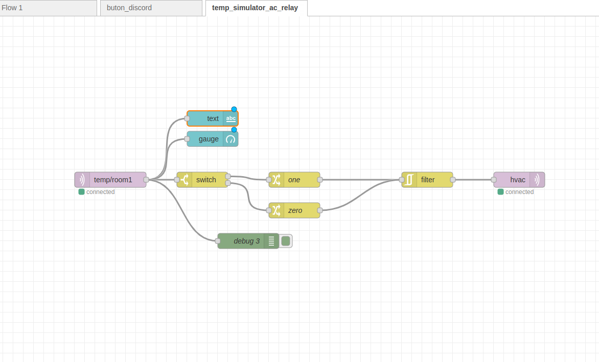

## Lab 5

You need to open the platformIO form the another window to get some libraries to be recognize. Have one organization window and on PIO porject window.

We first connect our temperature Python simulator to Node-red via the mqtt listen node. Then we used a dashboard gauge as an UI to give us the readings. 

Latter we connected a node listening to the node red topic hvac. If it went under or equal 26 it sent a 0 to the relay. If it was above 26 it sent a 1 to the relay node via hvac topic.

### Emergency Button

We flashed a D1 mini with the PubSubClient to send/publish example code and adapted it to subscribe to relay topic. It also sends "Hello bot" when the button is pressed to the button topic.

Then we created a bot in discord to listen to communicate with our node via Node-red running on the gateway following these instructions. https://www.writebots.com/discord-bot-token/

We used the the node-red-contrib-discord-advanced module installed via palette manager to integrate this communication. 

After setting up the Node-red node the token for the bot and the channel id (last numbers form the its link) we deployed the flow and the bot was working. 

Receiving "Hello bot" when button is pressed on the ESP. And turning LED (probe for the Relay) on if 1 is sent and off if 0. 

**ISSUES**

The node-red-contrib-discord-advanced V 3.3.4, the latest updated was actually not allowing us to send msg. 

Error msg

    "Privileged intent provided is not enabled or whitelisted Error" 

**Solution**

We downgraded to version 3.3.0 and it worked out of the box. 

