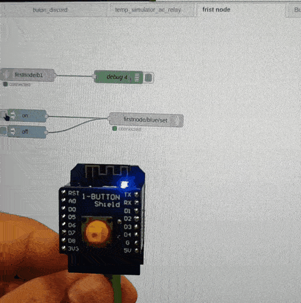

## Lab 6

ESP32 was not working. 

### First Node Lab

We followed the video tutorial and were successful at deploying the first node by using the Web server interface (Cloud Commander, CLI GUI). We understood that adapting it (initializing) and deploying(flashing it) are different actions. 

documentation here: https://github.com/iotempire/iotempower/blob/master/doc/first-node.rst

To get the button working we imported examples from the command list into:

test01 > setup.cpp

    input(b1, D3, "released", "pressed");

We than subscribed an MQTT input in Node-red to test01/b1 to see the msgs coming in. 

On task n.4 Button to sound and notification we were not able to get any sound out as it had no Voice installed on the PI. 

With the help of Professor Ulrich we were able to record some sound from our laptop using: 

    parecord hello_nodered.wav

Than we drag and dropped the audio file in the Pi file system via Cloud Commander. Finally using the node-red file node, we could direct this WAV to the Gauge out put sound notification node. 
We followed the video tutorial and were successful at deploying the first.

Flow can be found here:

     [{"id":"94f6e8e06801cc0f","type":"tab","label":"first and second node","disabled":false,"info":"","env":[]},{"id":"88df0ea2f3e58f3f","type":"debug","z":"94f6e8e06801cc0f","name":"debug 4","active":true,"tosidebar":true,"console":false,"tostatus":false,"complete":"false","statusVal":"","statusType":"auto","x":460,"y":140,"wires":[]},{"id":"f4aa61e451da07ec","type":"mqtt in","z":"94f6e8e06801cc0f","name":"","topic":"firstnode/b1","qos":"2","datatype":"auto-detect","broker":"4d6296f2db4785e3","nl":false,"rap":true,"rh":0,"inputs":0,"x":230,"y":140,"wires":[["88df0ea2f3e58f3f"]]},{"id":"b11c8e90b7dbf301","type":"mqtt out","z":"94f6e8e06801cc0f","name":"","topic":"firstnode/blue/set","qos":"","retain":"","respTopic":"","contentType":"","userProps":"","correl":"","expiry":"","broker":"4d6296f2db4785e3","x":530,"y":240,"wires":[]},{"id":"740f080172f64d8f","type":"inject","z":"94f6e8e06801cc0f","name":"","props":[{"p":"payload"}],"repeat":"","crontab":"","once":false,"onceDelay":0.1,"topic":"","payload":"on","payloadType":"str","x":230,"y":240,"wires":[["b11c8e90b7dbf301"]]},{"id":"ec1c2628059828e0","type":"inject","z":"94f6e8e06801cc0f","name":"","props":[{"p":"payload"}],"repeat":"","crontab":"","once":false,"onceDelay":0.1,"topic":"","payload":"off","payloadType":"str","x":230,"y":280,"wires":[["b11c8e90b7dbf301"]]},{"id":"4d6296f2db4785e3","type":"mqtt-broker","name":"local mqtt broker on gateway","broker":"192.168.12.1","port":"1883","clientid":"","autoConnect":true,"usetls":false,"protocolVersion":"4","keepalive":"60","cleansession":true,"birthTopic":"","birthQos":"0","birthPayload":"","birthMsg":{},"closeTopic":"","closeQos":"0","closePayload":"","closeMsg":{},"willTopic":"","willQos":"0","willPayload":"","willMsg":{},"userProps":"","sessionExpiry":""}]   

### Second Node

Ok. Sending form node-red to light IN_BUILT LED.

the code is the same for Nodes 1 and 2

https://github.com/Gautier30/iot-ReyVai/tree/main/Pair_Folder/Arduino_sketches/d1%20mini_button_discord

### Button to sound

https://discord.com/channels/@me/1085318510395281550/1086313113437089823

Flow:

    [{"id":"9ef414088e30f623","type":"tab","label":"Button to sound","disabled":false,"info":"Week 6 lab tasks","env":[]},{"id":"13a36cee7e6cb5c7","type":"mqtt in","z":"9ef414088e30f623","name":"","topic":"firstnode/b1","qos":"2","datatype":"auto-detect","broker":"4d6296f2db4785e3","nl":false,"rap":true,"rh":0,"inputs":0,"x":210,"y":240,"wires":[["0b145b5e8f38eec4"]]},{"id":"c4cb88e1429c5446","type":"ui_audio","z":"9ef414088e30f623","name":"button audio out","group":"2e7b447f8a602f27","voice":"","always":"","x":1080,"y":220,"wires":[]},{"id":"0b145b5e8f38eec4","type":"switch","z":"9ef414088e30f623","name":"","property":"payload","propertyType":"msg","rules":[{"t":"eq","v":"pressed","vt":"str"},{"t":"eq","v":"depressed","vt":"str"}],"checkall":"true","repair":false,"outputs":2,"x":430,"y":240,"wires":[["d2484da2919d24e9"],["225d8b40ea7f629d"]]},{"id":"d2484da2919d24e9","type":"change","z":"9ef414088e30f623","name":"one","rules":[{"t":"set","p":"payload","pt":"msg","to":"1","tot":"str"}],"action":"","property":"","from":"","to":"","reg":false,"x":610,"y":240,"wires":[["a751167b57711a07"]]},{"id":"225d8b40ea7f629d","type":"change","z":"9ef414088e30f623","name":"zero","rules":[{"t":"set","p":"payload","pt":"msg","to":"0","tot":"str"}],"action":"","property":"","from":"","to":"","reg":false,"x":610,"y":300,"wires":[[]]},{"id":"39ff52da7ac08bcc","type":"debug","z":"9ef414088e30f623","name":"debug 5","active":true,"tosidebar":true,"console":false,"tostatus":false,"complete":"false","statusVal":"","statusType":"auto","x":1060,"y":300,"wires":[]},{"id":"a751167b57711a07","type":"file in","z":"9ef414088e30f623","name":"audio hello","filename":"/home/iot/assets/button_nodered.wav","filenameType":"str","format":"","chunk":false,"sendError":false,"encoding":"none","allProps":false,"x":850,"y":240,"wires":[["39ff52da7ac08bcc","c4cb88e1429c5446"]]},{"id":"4d6296f2db4785e3","type":"mqtt-broker","name":"local mqtt broker on gateway","broker":"192.168.12.1","port":"1883","clientid":"","autoConnect":true,"usetls":false,"protocolVersion":"4","keepalive":"60","cleansession":true,"birthTopic":"","birthQos":"0","birthPayload":"","birthMsg":{},"closeTopic":"","closeQos":"0","closePayload":"","closeMsg":{},"willTopic":"","willQos":"0","willPayload":"","willMsg":{},"userProps":"","sessionExpiry":""},{"id":"2e7b447f8a602f27","type":"ui_group","name":"Default","tab":"f084747d9b4f2415","order":1,"disp":true,"width":"6","collapse":false,"className":""},{"id":"f084747d9b4f2415","type":"ui_tab","name":"Home","icon":"dashboard","disabled":false,"hidden":false}]

